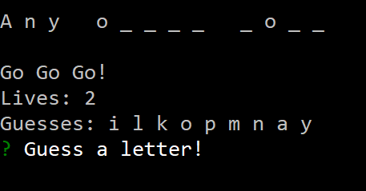

# Node.js Hangman Game

This is linked at my crappy temporary [Portfolio](https://jonmpan.github.io/Bootstrap-Portfolio/).

*Much Needed Improvements:*
- Everything
- Disable inputs until the prompt to play again pops up
- More better words and keeps track of the word bank
- Cosmetic improvements

**Never Forget:**

> `npm i`

**Node Packages Used**

Inquirer | ASCiify-image
-------- | -------------
 [inquirer](https://www.npmjs.com/package/inquirer) | [asciify-image](https://www.npmjs.com/package/asciify-image)
Used to inquire user for their guess | Converts images into ASCII format to display